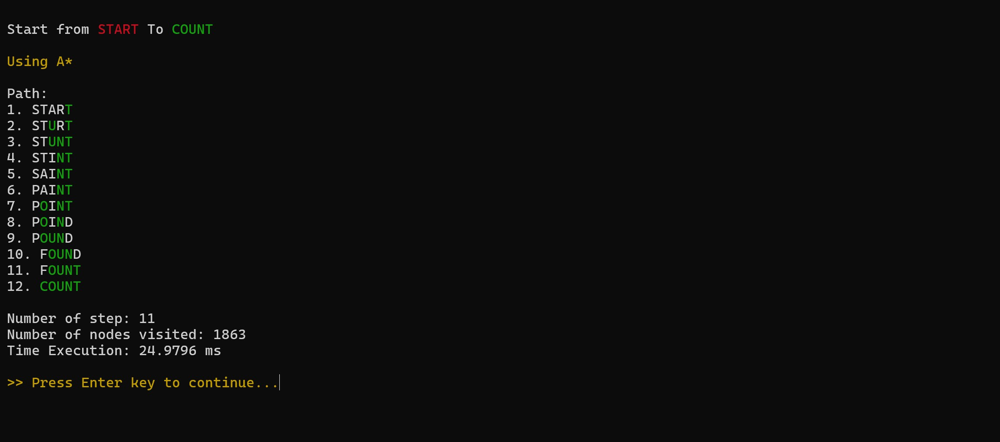

# Tugas Kecil 3 IF2211 Strategi Algoritma
Penyelesaian Permainan Word Ladder Menggunakan Algoritma UCS, Greedy Best First Search, dan A*

## Daftar Isi
- [Tugas Kecil 1 IF2211 Strategi Algoritma](#Tugas-Kecil-1-IF2211-Strategi-Algoritma)
  - [Daftar Isi](#Daftar-Isi)
  - [Author](#Author)
  - [Ringkasan](#Ringkasan)
  - [Struktur Program](#Struktur-Program)
  - [Requirement](#Requirement)
  - [Cara Menjalankan](#Cara-Menjalankan)
  - [Screenshoot](#Screenshoot)
  - [Contact](#Contact)

## Author
| Nama  | NIM |
| ------------- | ------------- |
| Naufal Adnan  |  13522116  |

## Ringkasan
Repository ini berisi implementasi dari program untuk mendapatkan solusi dari permainan Word Laddder. Program diimplementasikan dalam bahasa Java berbasis CLI (Command Line Interface) dan GUI yang dapat menemukan solusi permainan word ladder menggunakan algoritma UCS, Greedy Best First Search, dan A*. Program menggunakan dictionary bahasa inggris sehingga kata-kata yang dapat dimasukkan harus berbahasa Inggris.

Word ladder (juga dikenal sebagai Doublets, word-links, change-the-word puzzles, paragrams, laddergrams, atau word golf) adalah salah satu permainan kata yang terkenal bagi seluruh kalangan. Word ladder ditemukan oleh Lewis Carroll, seorang penulis dan matematikawan, pada tahun 1877. Pada permainan ini, pemain diberikan dua kata yang disebut sebagai start word dan end word. Untuk memenangkan permainan, pemain harus menemukan rantai kata yang dapat menghubungkan antara start word dan end word. Banyaknya huruf pada start word dan end word selalu sama. Tiap kata yang berdekatan dalam rantai kata tersebut hanya boleh berbeda satu huruf saja. Pada permainan ini, diharapkan solusi optimal, yaitu solusi yang meminimalkan banyaknya kata yang dimasukkan pada rantai kata. Berikut adalah ilustrasi serta aturan permainan.

## Struktur Program
```bash
.
│   
├───bin                         
│    │  # All file java .class
│
├───doc                          # Documentation
│    │  Tucil3_13522116.pdf
│
├───src                          # Source code
│    │  Asset
│    │    │ # All asset for GUI
│    │    
│    │  CLI
│    │    │ # All fitur CLI
│    │   
│    │  interfaces
│    │    │ # All fitur GUI
│    │    
│    │  lib
│    │    │ # All lib used for algorithm
│    │    
│    │  wordladder
│    │    │ # Algorithm implementation (UCS, GBFS, A*)
│
├───test                        
│    ├─── CLI
│    │      │ # all test from CLI
│    │
│    ├─── GUI
│           │ # all test from GUI
│
│ dictionary.txt
│ README.md
│ runCLI.bat
│ runGUI.bat
.
```

## Requirement
Program dibuat menggunakan bahasa Java v 20.0.2 dan GUI dibuat menggunakan Java Swing
* [Java](https://www.oracle.com/java/)

## Cara Menjalankan
1. Install Java
   <br>Pastikan Java telah terinstall di OS Anda dan bukan versi headless karena untuk menjalankan GUI diperlukan headful library support. Download java melalui web [Java](https://www.oracle.com/java/) atau untuk OS Linux jalankan perintah berikut ke terminal:
   * Install Java
      ```sh
      sudo apt install openjdk-19-jdk
      ```
2. Clone Repository
   ```sh
   git clone https://github.com/nanthedom/Tucil3_13522116
   ```
3. Buka folder "Tucil3_13522116" di terminal
4. Lalu run:
   * Windows
      * Menjalankan di CLI
         ```sh
         ./runCLI.bat
         ```
      * Menjalankan GUI
         ```sh
         ./runGUI.bat
         ```
   * Linux
      * Menjalankan di CLI
         ```sh
         ./runCLI.sh
         ```
      * Menjalankan GUI
         ```sh
         ./runGUI.sh
         ```
5. Masukkan start word dan end word yang Anda inginkan lalu temukan solusinya!

Note: Anda bisa mengganti dictionary dengan dictionary yang lebih lengkap atau yang anda inginkan dengan menempatkannya di root folder Tucil3_13522116 dan pastikan menggantinya dengan nama "dictionary.txt" agar bisa di-load.

## Screenshoot
### GUI
<p align="center">


</p>

### CLI
<p align="center">



</p>

## Contact
Naufal Adnan - naufnan@gmail.com